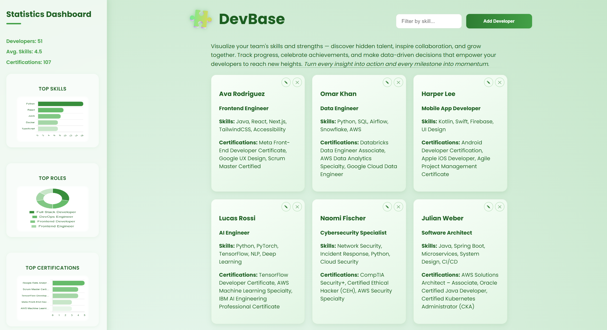

<div align="center">
  
# 🧩 Developer Skill API


</div>

---

<div align="center">

## Project Overview
A Clean, Scalable Java Spring Boot REST API  

</div>

**DeveloperSkillAPI** is a backend project built with **Spring Boot** to demonstrate clean API architecture, **OOP design principles**, and structured **JSON data handling**.  
It’s designed for learning, interviews, or as part of a developer portfolio to showcase backend proficiency and RESTful design.

---
<div align="center">

## Core Features
What Makes This API Clean, Extensible, and Developer-Friendly

</div>

- **RESTful Endpoints** — Organized using MVC patterns  
- **OOP Architecture** — Separation between controllers, services, and models  
- **JSON Integration** — Automatic serialization/deserialization for API communication  
- **Error Handling** — Custom exception responses for better debugging  
- **Extensibility** — Built to easily add new endpoints or modules  

---

<div align="center">

## UI Preview
Snapshot or visual demo of what the app looks like running



</div>

---

<div align="center">

## Tech Stack Overview
Tools, Frameworks, and Their Roles in the Project

</div>  

<div align="center">

<table>
  <tr>
    <th>Category</th>
    <th>Technology</th>
    <th>Purpose</th>
  </tr>
  <tr>
    <td><b>Language</b></td>
    <td>Java</td>
    <td>Implements core API logic and data models.</td>
  </tr>
  <tr>
    <td><b>Framework</b></td>
    <td>Spring Boot</td>
    <td>Provides REST API setup, DI, and configuration management.</td>
  </tr>
  <tr>
    <td><b>Build Tool</b></td>
    <td>Maven</td>
    <td>Manages dependencies and automates project builds.</td>
  </tr>
  <tr>
    <td><b>Data Format</b></td>
    <td>JSON</td>
    <td>Handles client–server data exchange.</td>
  </tr>
  <tr>
    <td><b>Testing</b></td>
    <td>JUnit, Postman</td>
    <td>JUnit for automated tests; Postman for API validation.</td>
  </tr>
  <tr>
    <td><b>Architecture</b></td>
    <td>MVC</td>
    <td>Separates controllers, services, and models for clarity.</td>
  </tr>
  <tr>
    <td><b>API Design</b></td>
    <td>REST</td>
    <td>Implements standard CRUD endpoints via HTTP methods.</td>
  </tr>
</table>

</div>

---

<div align="center">

## API Endpoint Reference
Explore the CRUD Operations Available in Developer Skill API

</div>

<div align="center">

| Method | Endpoint | Description |
|--------|-----------|-------------|
| GET | `/api/developers` | Fetch all developers |
| GET | `/api/developers/{id}` | Retrieve a developer by ID |
| POST | `/api/developers` | Add a new developer |
| PUT | `/api/developers/{id}` | Update an existing developer |
| DELETE | `/api/developers/{id}` | Delete a developer |
</div>

---

<div align="center">

## Example Request & Response
Demonstrating JSON Data Flow Through API Endpoints

</div>

```json
{
  "name": "John Doe",
  "title": "Java Developer",
  "skills": ["Spring Boot", "API Design", "JSON"],
  "certifications": ["Oracle Java SE"]
}

```
<div align="center">

## GET Example Response

</div>

```http
GET /api/skills
```
Response:
```json
[
  {
    "id": 1,
    "name": "Java",
    "level": "Intermediate"
  },
  {
    "id": 2,
    "name": "Spring Boot",
    "level": "Beginner"
  }
]
```
---

<div align="center">

## Project Purpose & Learning Goals
Why This Project Matters and What It Demonstrates

</div>

This API showcases backend proficiency, API documentation, and clean architecture principles suitable for developer portfolios or technical interviews.

---

<div align="center">

## Local Setup & Execution Guide
Run and Test Developer Skill API on Your Own Machine

</div>

1. **Clone the repository**
   ```bash
   git clone https://github.com/lpatamia1/DeveloperSkillAPI.git
   cd DeveloperSkillAPI
2. **Build and run the application**
   ```bash
   mvn spring-boot:run
3. **Access the API**
   ```bash
   http://localhost:8080/api/developers
4. **Test endpoints using Postman or curl**
   ```bash
   curl -X GET http://localhost:8080/api/developers
   ```
Test endpoints using Postman or cURL:
```bash
curl -X GET http://localhost:8080/api/developers
```
---

<div align="center">

## What I Learned
Leveled up development experience and polishing portfolios

</div>

- Small CSS refinements (like width: 93% or margin-left: 15px) can completely change a layout’s balance and visual appeal.
- Learned how frontend JavaScript `fetch()` calls connect seamlessly with backend endpoints to complete the full CRUD (Create, Read, Update, Delete) cycle.
- Realized that README files are more than documentation — they’re storytelling tools that reflect design clarity, organization, and technical voice.
- Gained awareness of the difference between temporary local preview links and fully deployed live sites — and how to represent them gracefully using preview images and setup instructions.

---
<div align="center">

## Next Steps
Continuing to build, refine, and scale Developer Skill API

</div>

- Database Integration — Connect to a persistent database (like PostgreSQL or MySQL) to store developer data permanently.
- Swagger Documentation — Add Swagger UI for interactive API testing and clear endpoint visualization.
- Enhanced Validation — Implement input validation and error handling for a more robust user experience.
- Frontend Expansion — Build a separate React or Vue frontend that consumes the API and visualizes developer data dynamically.
- Cloud Deployment — Deploy the full application using Render, Railway, or AWS to make it accessible 24/7.

---

<div align="center"> Built with ☕, 💙, and clean architecture principles. 
  
<sub>Crafted with Spring Boot, Java, and creativity — by Lily Patamia 🌸</sub></div> 
